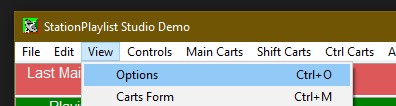
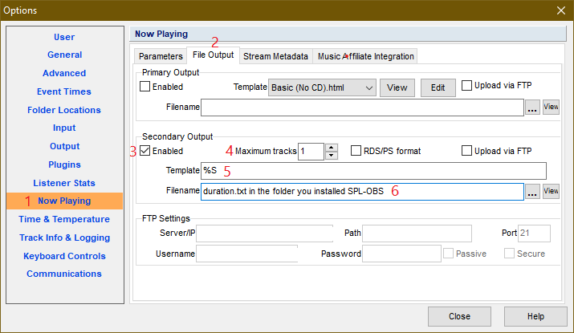
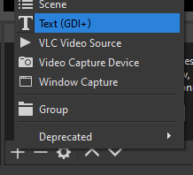
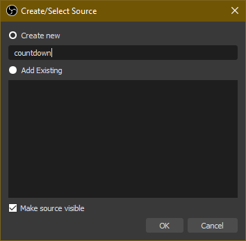
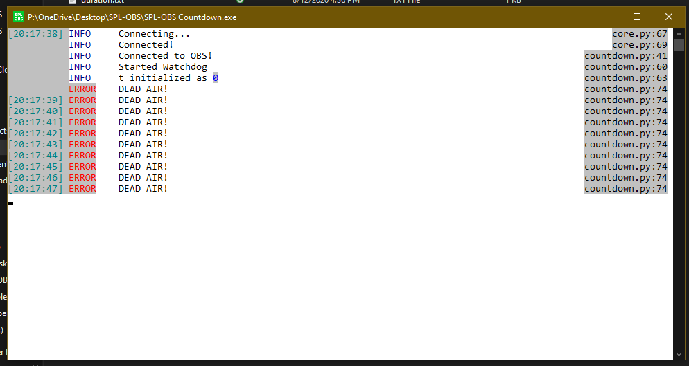
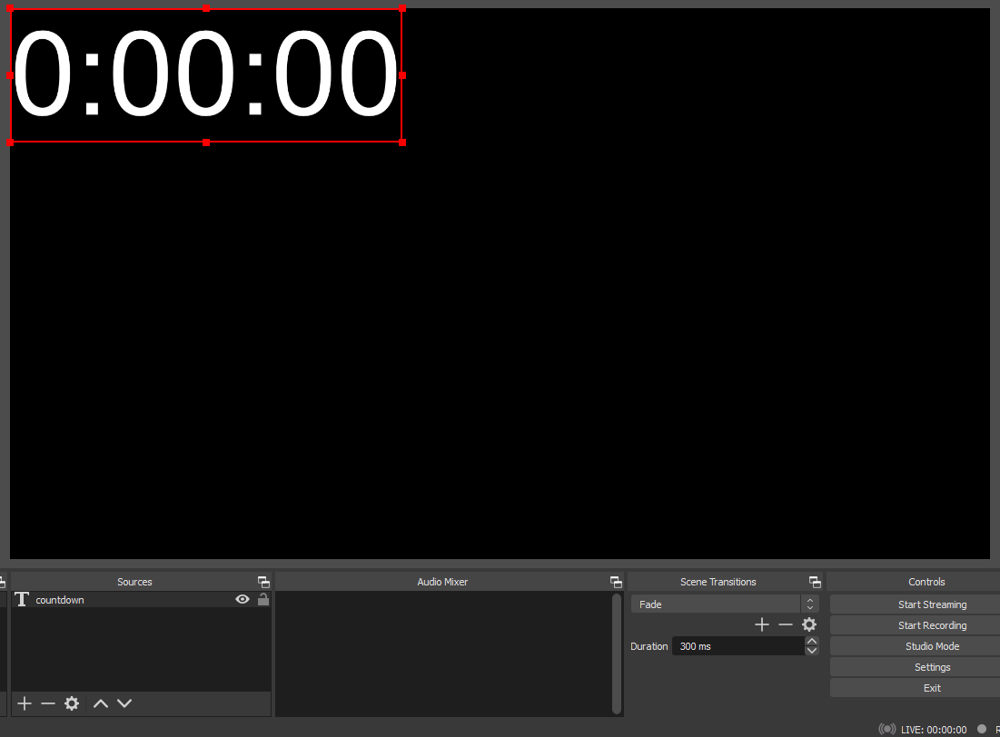
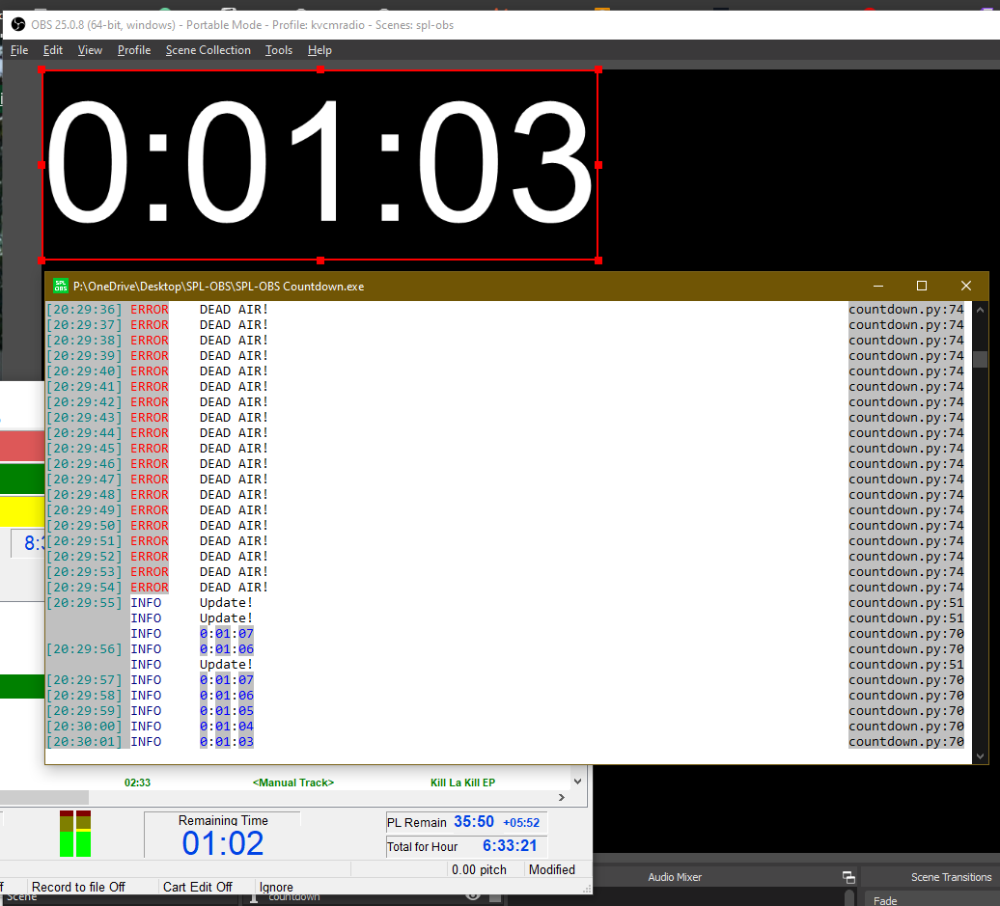

These are the instructions for setting up the countdown

## Table of contents
{: .no_toc .text-delta }
1. TOC
{:toc}

## StationPlaylist Studio
Go to `Controls > Options` in the toolbar or press `Ctrl+O`.

An options window should have popped up.

1. Go to the **Now Playing** section of the options.
2. Select the **File Output** tab.
3. Make sure the **Secondary Output** is **Enabled**.
4. Make sure the **Maximum Tracks** is **1**.
5. In the **Template** textbox, type in `%S` exactly, as shown.
6. Set the **Filename** to the `duration.txt` in the folder you installed SPL-OBS. Use the `...` button to open a file selector.

## Configuration
Configuration is done via a simple INI file, called `countdown.ini`:

The above are the defaults, should something break.

### `[obs-websockets]` (required)
Just copy over [the values you entered while setting up the WebSockets Server](../install#setup-the-websockets-server).

#### `host`
**Default:** `localhost`

This is essentially the IP address of the WebSockets server, in 99.999999999% of cases it will be `localhost`, only advanced users *(i.e. someone running StationPlaylist and OBS on seperate computers)* should ever need to change this.

#### `port`
**Default:** `4444`

The default port is `4444` which is also the default port of the WebSockets server. This can be changed but there generally is no reason to do so.

#### `password`
**Default:** `obs-spl`

**PLEASE CHANGE THE PASSWORD FROM THE DEFAULT.** Do so in both this file and [in OBS](../install#setup-the-websockets-server).

### `[debug]` (optional developer options)
You generally shouldn't need to mess with these, but if you want to anyway, here's what they do:

#### `launchtime`
**Default:** `0`

This is what the countdown starts at when you start the software. Useful for testing countdowns if you don't want to open StationPlaylist and play something from there.

#### `loglevel`
**Default:** `INFO`

This is the amount of output the program provides in the console log. Possible values are: `NOTSET`, `DEBUG`, `INFO`, `WARNING`, `ERROR`, and `CRITICAL`, in decreasing verbosity.

## OBS Studio
### Make sure your WebSockets server settings match those in `countdown.ini`.
See [Configuration](#configuration) and [Setup the WebSockets Server](../install#setup-the-websockets-server) for more information.

### Add the countdown source.
Add a new text source by going to `+ > Text (GDI+)`.

Call the new source `countdown`, with no casing or punctuation, then press OK.

You can ignore the properties window that pops up for now, by pressing OK or Cancel, either works.

## Testing and Usage
Double-click `SPL-OBS Countdown` executable in the folder you installed SPL-OBS in. A window like this should pop-up. If a window briefly pops up then disappears, or doesn't popup at all, check that [your configuration is correct](#configuration), specifically the [`[obs-websockets] config`](#obs-websockets-required).

You should get a window like this: (colours may vary)

Don't worry about the `ERROR	DEAD AIR!` messages, it just means that the countdown is at 0 seconds, so either nothing is playing or the countdown has no idea that something is.

You can also now see the timer in OBS:

If you trigger a song update, by playing a song or skipping to the next one, you should see the update in both the program window and in OBS:
