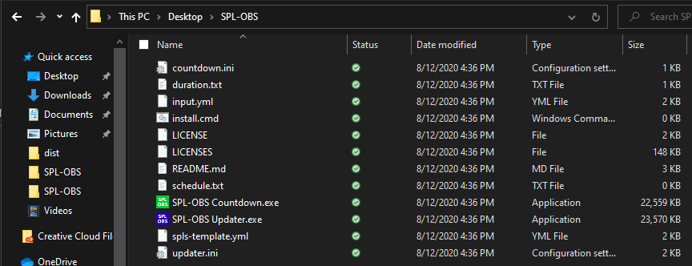
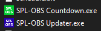
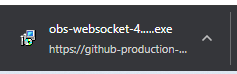
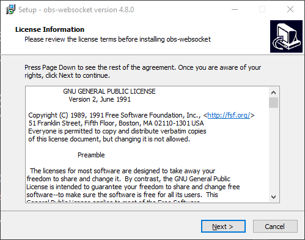
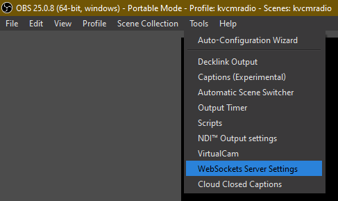
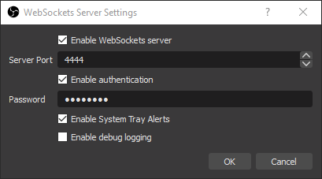
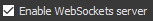

# Installation
These are the instructions for setting up the countdown for SPL-OBS.

## Table of contents
{: .no_toc .text-delta }
1. TOC
{:toc}

## Program Installation
### Download the files
Download the latest release from the releases page on GitHub:

[Download SPL-OBS](https://github.com/oofdere/SPL-OBS/releases){: .btn .btn-green }

### Unzip to a folder
Make a new folder in an easily accessible location, as this is where the program files will be stored, and is a folder you'll need to modify often. You can call it whatever you want, but a name like `SPL-OBS` on your desktop would probably be easier to find later than, say, `New Folder (18374)` in `Random Stuff (copy) (copy)`.

Then, extract the contents of the file you downloaded into the folder.

It should now look something like this:

Make sure the app icons are visible, if not, you might not have extracted the files:

## OBS Studio Setup
This section asssumes that you have a functional [OBS Studio](https://obsproject.com/) setup.

### Download `obs-websocket`
`obs-websocket` is the plugin that SPL-OBS uses to interface with OBS Studio, and must be installed to use SPL-OBS.

[Download obs-websocket](https://github.com/Palakis/obs-websocket/releases){: .btn .btn-green }

#### Use the `.exe` installer (recommended)
Use this if you installed OBS Studio normally (using an installer) and not portably

First, download the file `obs-websocket-4.8.0-Windows-Installer.exe` from the link above, then launch it.

**You will be asked for administrator privilages, which you should grant.**

Read and agree to the license.

And then press next until installation is complete.

#### `.zip` installation (advanced/portable)
If you have a portable install, are on another platform, or the installer doesn't work, download the `.zip` file in the releases and copy its contents into the root of your OBS Studio folder.

### Setup the WebSockets server
First, launch OBS Studio, then on the toolbar, go to `Tools > WebSockets Server Settings`

You should have a window like this pop-up:

The only thing you should have to change is the password, hopefully to one that is more secure.

You should also make sure that  is checked.

## Installation complete
The program is now installed, but must be set up to function properly.

[Updater Setup](updater/setup){: .btn .btn-purple .mr-2 }
[Countdown Setup](countdown/setup){: .btn .btn-purple }