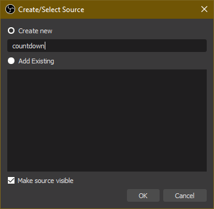

These are the instructions for setting up the updater (now playing and up next)

## Table of contents
{: .no_toc .text-delta }
1. TOC
{:toc}

# StationPlaylist Studio
## Adding `spls-template.yml` to your StationPlaylist templates
Go to `Controls > Options` in the toolbar or press `Ctrl+O`.

An options window should have popped up.

Go to the **Now Playing** section of the options, then select the **File Output** tab.

If not, next to the template, click on the Edit button:

(the selected template does not matter)

Delete everything in the notepad window that opened up, then copy and paste all the contents of `spls-template.yml` (located in the directory you installed SPL-OBS into, or [here](https://github.com/oofdere/SPL-OBS/blob/master/spls-template.yml)) into there.

Then, go to `File > Save As` or `Ctrl+Shift+S`, and save as `spls-template.yml` alongside all the other templates, making sure to choose `All Files (*.*)` under the *Save as type:* dropdown:

Close the StationPlaylist options screen and notepad.

## Configuring the output
With that done, it's time to configure the primary output section of StationPlaylist.

Go to `Controls > Options` in the toolbar or press `Ctrl+O`.

An options window should have popped up.

1. Go to the **Now Playing** section of the options.
2. Select the **File Output** tab.
3. Make sure the **Primary Output** is **Enabled**.
5. In the **Template** dropdown, select the `spls-template.yml` file you made in the last section.
6. Set the **Filename** to the `input.yml` in the folder you installed SPL-OBS. Use the `...` button to open a file selector.

# Configuration
Configuration is done via a simple INI file, called `updater.ini`:

The above are the defaults, should something break.

## `[obs-websockets]` (required)
Just copy over [the values you entered while setting up the WebSockets Server](../install#setup-the-websockets-server).

### `host`
**Default:** `localhost`

This is essentially the IP address of the WebSockets server, in 99.999999999% of cases it will be `localhost`, only advanced users *(i.e. someone running StationPlaylist and OBS on seperate computers)* should ever need to change this.

### `port`
**Default:** `4444`

The default port is `4444` which is also the default port of the WebSockets server. This can be changed but there generally is no reason to do so.

### `password`
**Default:** `obs-spl`

**PLEASE CHANGE THE PASSWORD FROM THE DEFAULT.**
{: .red-300 }
Do so in both this file and [in OBS](../install#setup-the-websockets-server).

## `[twitch]`
See the [Twitch](twitch) page.

## `[nowplaying]`
See the [Now Playing Options](now-playing) page for more options.
### `enabled`
**Default:** `yes`

Set to `no` to entirely disable the now playing display.

## `[upcoming]`
See the [Upcoming Options](upcoming) page for more options.
### `enabled`
**Default:** `yes`

Set to `no` to entirely disable the upcoming songs display.

## `[debug]` (optional developer options)
You generally shouldn't need to mess with these, but if you want to anyway, here's what they do:

### `loglevel`
**Default:** `INFO`

This is the amount of output the program provides in the console log. Possible values are: `NOTSET`, `DEBUG`, `INFO`, `WARNING`, `ERROR`, and `CRITICAL`, in decreasing verbosity.

# OBS Studio
SECTION UNFINISHED
{: .label .label-red }
## Make sure your WebSockets server settings match those in `countdown.ini`.
SECTION CONTAINS INACCURACIES
{: .label .label-yellow }
See [Configuration](#configuration) and [Setup the WebSockets Server](../install#setup-the-websockets-server) for more information.

## Add the `nowplaying` and `upnext` sources.
Add a new text source by going to `+ > Text (GDI+)`.

Call the new sources `nowplaying` and `upnext`, with no spaces, casing, or punctuation, then press OK.

IMAGE NEEDS REPLACEMENT
{: .label .label-red }

You can ignore the properties window that pops up for now, by pressing OK or Cancel, either works.

# Testing and Usage
Double-click `SPL-OBS Countdown` executable in the folder you installed SPL-OBS in. A window like this should pop-up. If a window briefly pops up then disappears, or doesn't popup at all, check that [your configuration is correct](#configuration), specifically the [`[obs-websockets] config`](#obs-websockets-required).

SECTION UNFINISHED
{: .label .label-red }